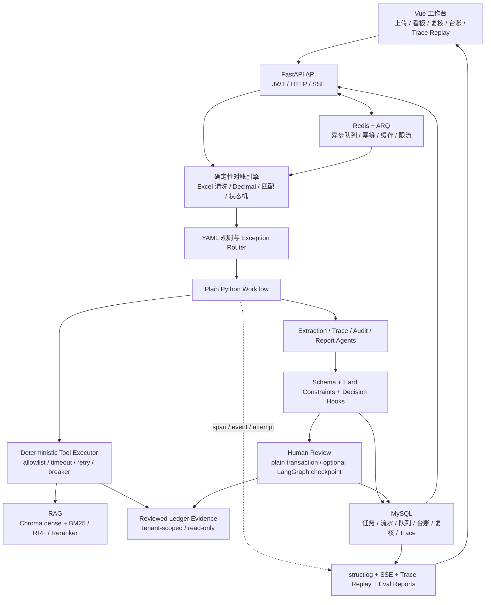

# 银企智能对账 Agent

一套面向银企流水与银行清算流水的对账、异常审计和人工复核系统：确定性代码负责金额与状态，规则负责分支路由，Agent 负责非结构化理解与解释，人工保留最终业务判断权。

> 本项目是个人作品和本地可运行原型，只使用模拟或脱敏数据。默认演示不调用真实 LLM，也不代表生产部署、业务收益或银行内部系统。

## 项目背景

财务对账并不只是“比较两个金额”。真实流程还要处理字段口径差异、单边流水、跨期入账、摘要不一致、重复记账、证据查找、人工复核和审计留痕。

本项目把这条流程拆成可验证的工程边界：

- 精确匹配、金额计算、候选唯一性和状态变更由确定性代码完成。
- YAML 规则和任务/队列状态机决定异常类型、处理分支和终态。
- Agent 只读取受控上下文，用于摘要提取、交易追溯、审计建议和报告叙述。
- RAG 提供可引用的规则证据；无证据、低置信、冲突或工具失败时 fail closed 转人工。
- 低置信分支可以按需读取近期已复核差错台账；读取失败或证据不足时转人工。

第一次阅读项目时，请先看 [`docs/current-system-map.md`](docs/current-system-map.md)。该文档只描述当前代码路径，不混入历史 Stage 和未来规划。

## 核心能力

- **双场景对账**：支持 `BANK_ENTERPRISE` 银企对账和 `BANK_CLEARING` 银行清算对账。
- **确定性匹配与路由**：解析 Excel，使用 `Decimal` 计算金额，执行精确匹配、模糊候选和单边残留识别，再由场景化 YAML 规则路由异常。
- **受约束 Agent 链路**：ExtractionAgent、TraceAgent、AuditAgent 和 ReportAgent 通过 Pydantic 结构化输出、硬约束与决策 Hook 接入业务流程。
- **RAG 证据检索**：ChromaDB dense 检索，可选 BM25、RRF、Reranker 和 Query Rewrite；检索结果保留来源、分数和 chunk ID。
- **确定性工具调用**：工作流而非 LLM 自主选择 `search_rules`、`lookup_t1_context` 和 `load_confirmed_cases`；工具具有白名单、严格参数、租户上下文、超时、重试和稳定结果状态。
- **复核台账证据**：L2 只读工具按租户和异常分支读取近期已复核差错台账；空结果、冲突或读取失败均转人工。
- **Human-in-the-Loop**：支持待复核列表、确认平账、强制挂账和可选 LangGraph SQLite checkpoint 子图。
- **可观测闭环**：structlog、Prompt 版本、Agent/Tool attempt、SSE 实时事件、持久化 Trace 和只读 Replay 页面共同还原执行过程。
- **可运行交付**：FastAPI + Vue 前后端、JWT、MySQL、Redis/ARQ、五服务 Docker Compose、外部 smoke 和 GitHub Actions CI。

## 系统架构



主流程采用普通 Python 编排，便于明确控制副作用、Fallback 和 Trace；LangGraph 只用于可选的人工复核 checkpoint 子图，不承担整条对账主链路。

## 核心业务流程

```text
上传两份 Excel
  → 文件大小、行数、字段与数据类型校验
  → 标准化与 Decimal 金额计算
  → 精确匹配 / 模糊候选 / 单边残留识别
  → YAML 规则命中与异常分支路由
  → 确定性工具读取规则、T+1 上下文和近期已复核台账
  → Agent 生成结构化建议
  → Schema 校验 → 硬约束 → 决策/Fallback
  → 自动平账，或写入差错台账并进入人工复核
  → 人工确认/挂账 → 原子更新台账、队列和任务状态
  → 报告、指标、Trace Replay 和离线 Eval
```

### 规则、状态机、Agent 与人工如何分工

| 组件 | 负责 | 不负责 |
| --- | --- | --- |
| 确定性代码 | Excel 校验、匹配、金额/日期计算、候选唯一性、事务写入 | 解释非结构化文本 |
| YAML 规则与状态机 | 异常分类、优先级、任务/队列状态转换 | 生成自然语言审计意见 |
| RAG 与 Tool Executor | 受控只读检索、来源投影、重试和失败分类 | 绕过租户/分支权限或直接写业务库 |
| Agent | 摘要提取、追溯线索、基于证据的建议、报告叙述 | 计算金额、修改规则、直接落库 |
| 人工复核 | 接受或推翻建议，确认最终业务动作 | 被历史多数或模型置信度自动替代 |

## 技术栈

- **后端**：Python 3.11+、FastAPI、Pydantic v2、SQLAlchemy Core、Pandas、structlog
- **Agent / RAG**：OpenAI-compatible provider、DeepSeek opt-in、ChromaDB、BM25、RRF、LangGraph checkpoint 子图
- **数据与任务**：MySQL 8.4、Redis 7.4、ARQ、SQLite 测试与 checkpoint
- **前端**：Vue 3、TypeScript、Vite、Vue Router、Element Plus、ECharts、Vitest
- **工程化**：uv、pytest、ruff、Docker Compose、GitHub Actions

## 关键工程设计

1. **确定性逻辑优先**：金额使用 `Decimal`，LLM 不参与账务计算、候选唯一性或数据库写入。
2. **结构化输出不是最终防线**：Pydantic Schema 之后仍执行硬约束和决策 Hook；高风险、低置信、无证据和异常输出统一转人工。
3. **工具是代码编排的只读边界**：Tool Executor 校验名称、参数、场景、`user_id/task_id/flow_id` 归属，并将结果归一为 `SUCCEEDED / EMPTY / FAILED`。
4. **复核台账不是独立记忆系统**：L2 当前只读取近期已复核差错台账，不存在版本化 Confirmed Case Store，也不建立用户画像。
5. **副作用延后且可审计**：Agent 阶段只产生候选决策，校验通过后再事务落库；人工复核、台账终态与任务统计保持原子边界。
6. **Trace 与业务结果解耦**：每个 flow 记录 Workflow、Route、Tool、Agent、Guard 和终态 span；Trace 写入失败不会改写已经确定的业务结果。
7. **评测证据分层**：Fake/hash 确定性检查用于默认 CI；真实 provider、真实 embedding、延迟/token/成本只作为 opt-in 离线诊断，不包装为生产 SLA。

当前模块边界见 [`ADR-34.1`](decisions/ADR-34.1-current-application-module-boundaries.md)。长期决策见 [`decisions/`](decisions/)；[`ADR-33.1`](decisions/ADR-33.1-confirmed-case-store.md) 仅描述尚未落地的案例库方案。

## 目录结构

```text
src/bank_reconciliation_agent/
  api/             FastAPI 路由、JWT 依赖
  agents/          Extraction / Trace / Audit / Report Agents
  core/            配置、日志、Prompt、LLM provider 与可靠性封装
  db/              SQLAlchemy engine 与 MySQL DDL
  rag/             Dense、BM25、RRF、Reranker、Query Rewrite
  schemas/         API、Agent、Tool、Trace 的 Pydantic contract
  services/        应用入口及按输入、批次、flow、决策、持久化拆分的服务模块
frontend/          Vue 工作台与前端测试
rules/             两类场景的 YAML 规则
prompts/           版本化 Agent Prompt
data/rag/          公开来源摘要、规则 chunks 与 RAG eval set
mock_data/         完全模拟的 Excel 演示数据
scripts/           数据生成、smoke、Eval、benchmark 与维护脚本
tests/             后端单元、集成、边界与离线评测测试
reports/           已生成的离线评测与证据快照
decisions/         ADR
docs/stages/       已完成 stage 的 spec、tasks 与 verification
```

## Quick Start：Docker Compose

前置条件：Docker Desktop 或兼容的 Docker Engine + Compose。

```bash
cp .env.example .env
docker compose up --build -d --wait
```

Compose 启动 `mysql`、`redis`、`backend`、`worker`、`frontend` 五个服务。演示拓扑会覆盖为 `LLM_PROVIDER=fake`、`EMBEDDING_BACKEND=hash`，无需模型凭证或下载 embedding 模型。

- 前端：<http://127.0.0.1:4173/>
- Swagger：<http://127.0.0.1:8000/docs>
- 健康检查：<http://127.0.0.1:8000/health>
- 演示账号：`demo_user` / `demo12345`

```bash
curl http://127.0.0.1:8000/health
# {"status":"ok","service":"Bank Reconciliation Agent","db":"ok"}
```

运行外部黑盒 smoke，覆盖 JWT、ARQ、SSE、人工复核和报告：

```bash
uv sync --extra dev
uv run python -m scripts.smoke_demo --summary-json artifacts/smoke-summary.json
```

停止并删除本地演示卷：

```bash
docker compose down --volumes --remove-orphans
```

> `.env.example` 和 Compose 中的密码、JWT secret 仅用于本地演示，不能用于真实环境。

## 本地开发

前置条件：Python 3.11+、uv、MySQL；前端使用 Node.js 22。只有异步路径需要 Redis/ARQ。

```bash
uv sync --extra dev
cp .env.example .env

# 本地无凭证开发建议在 .env 中使用：
# LLM_PROVIDER="fake"
# EMBEDDING_BACKEND="hash"
# ASYNC_QUEUE_ENABLED="false"
# 并把 MYSQL_DSN 改为本机 MySQL 连接串

uv run python -m scripts.reset_db --yes
uv run uvicorn bank_reconciliation_agent.main:app --reload
```

前端：

```bash
cd frontend
npm ci
npm run dev
```

前端默认运行在 <http://127.0.0.1:5173/>，Vite 将 `/api` 代理到 `http://127.0.0.1:8000`。

启用异步上传时，将 `ASYNC_QUEUE_ENABLED=true` 并启动 Redis 与 worker：

```bash
uv run arq bank_reconciliation_agent.worker.WorkerSettings
```

真实本地 embedding 需要额外依赖与模型资源：

```bash
uv sync --extra dev --extra embedding
```

随后将 `EMBEDDING_BACKEND` 设为 `bge_small` 或 `bge_m3`。真实 DeepSeek 调用则需要显式设置 `LLM_PROVIDER=deepseek` 和 `DEEPSEEK_API_KEY`。

## 环境变量

完整默认值见 [`.env.example`](.env.example)。常用分组如下：

| 变量 | 作用 |
| --- | --- |
| `APP_NAME`, `APP_ENV`, `API_V1_PREFIX` | 应用名称、环境和 API 前缀 |
| `MYSQL_DSN`, `CHROMA_PATH`, `UPLOAD_DIR` | MySQL、Chroma 持久化路径和上传目录 |
| `JWT_SECRET_KEY`, `JWT_ALGORITHM`, `JWT_ACCESS_TOKEN_EXPIRE_MINUTES` | JWT 签发与过期配置 |
| `DEMO_USER_PASSWORD` | 本地 `demo_user` 密码 |
| `LLM_PROVIDER` | `fake` 或 `deepseek` |
| `DEEPSEEK_API_KEY`, `DEEPSEEK_MODEL`, `DEEPSEEK_BASE_URL` | DeepSeek opt-in 配置 |
| `LLM_TIMEOUT_SECONDS`, `LLM_MAX_ATTEMPTS`, `LLM_BACKOFF_BASE_SECONDS`, `LLM_BACKOFF_MAX_SECONDS` | LLM 超时、重试和退避 |
| `LLM_BREAKER_FAIL_THRESHOLD`, `LLM_BREAKER_OPEN_SECONDS` | LLM 熔断阈值和恢复时间 |
| `ENABLE_LLM_CACHE`, `LLM_CACHE_TTL_SECONDS` | Redis LLM 缓存开关和 TTL |
| `ENABLE_LLM_RATE_LIMIT`, `LLM_RATE_LIMIT_RPM`, `LLM_RATE_LIMIT_MAX_CONCURRENCY`, `LLM_RATE_LIMIT_MAX_WAIT_SECONDS`, `LLM_RATE_LIMIT_WINDOW_SECONDS` | Redis LLM 限流配置 |
| `EMBEDDING_BACKEND` | `hash`、`bge_small` 或 `bge_m3` |
| `ENABLE_RAG_REWRITE`, `ENABLE_RAG_HYBRID`, `ENABLE_RAG_RERANKER` | RAG 分层能力开关 |
| `RAG_DENSE_TOP_N`, `RAG_BM25_TOP_N`, `RAG_RERANK_TOP_K`, `RAG_RRF_K` | 召回数量与融合参数 |
| `RAG_DENSE_MIN_SCORE`, `RAG_DENSE_MIN_SCORE_BGE_SMALL`, `RAG_DENSE_MIN_SCORE_BGE_M3`, `RAG_RERANKER_MIN_SCORE`, `RAG_LOW_SCORE` | 检索与 Fallback 阈值 |
| `REDIS_DSN`, `ASYNC_QUEUE_ENABLED` | Redis 和 ARQ 异步路径 |
| `JOB_IDEMPOTENCY_TTL_SECONDS`, `ARQ_JOB_MAX_ATTEMPTS`, `ARQ_JOB_TIMEOUT_SECONDS` | 作业幂等、重试和超时 |
| `CHECKPOINT_ENABLED`, `CHECKPOINT_SQLITE_PATH` | 人工复核 LangGraph checkpoint |
| `MAX_UPLOAD_BYTES`, `MAX_UPLOAD_ROWS`, `CUTOFF_WINDOW` | 上传与清算 cutoff 业务边界 |

## API 使用示例

以下示例使用同步上传，不依赖 Redis worker：

```bash
BASE=http://127.0.0.1:8000/api/v1

TOKEN=$(curl -sS -X POST "$BASE/auth/login" \
  -H "Content-Type: application/json" \
  -d '{"username":"demo_user","password":"demo12345"}' \
  | python -c 'import json,sys; print(json.load(sys.stdin)["data"]["access_token"])')

UPLOAD=$(curl -sS -X POST "$BASE/reconcile/upload" \
  -H "Authorization: Bearer $TOKEN" \
  -F bank_file=@mock_data/mvp1_bank.xlsx \
  -F clear_file=@mock_data/mvp1_clear.xlsx \
  -F scenario_type=BANK_ENTERPRISE)

TASK_ID=$(printf '%s' "$UPLOAD" \
  | python -c 'import json,sys; print(json.load(sys.stdin)["data"]["task_id"])')

curl -sS "$BASE/reconcile/$TASK_ID/status" \
  -H "Authorization: Bearer $TOKEN"

curl -sS "$BASE/reconcile/$TASK_ID/exceptions" \
  -H "Authorization: Bearer $TOKEN"

curl -sS "$BASE/review/pending?task_id=$TASK_ID" \
  -H "Authorization: Bearer $TOKEN"

curl -sS "$BASE/reconcile/$TASK_ID/report" \
  -H "Authorization: Bearer $TOKEN"
```

其他主要接口：

- `POST /api/v1/reconcile/upload-async`：ARQ 异步上传，要求 `ASYNC_QUEUE_ENABLED=true`。
- `POST /api/v1/reconcile/stream`：上传并返回同一请求内的 SSE 事件流。
- `POST /api/v1/reconcile/{task_id}/start-live` + `GET .../events`：按任务订阅实时事件。
- `POST /api/v1/review/{queue_id}/approve`：`APPROVED_MATCH` 或 `FORCE_HOLD`。
- `GET /api/v1/ledger`：分页查询差错台账。
- `POST /api/v1/rag/search`：调试 RAG 检索。
- `GET /api/v1/traces/{task_id}/flows/{flow_id}?trace_id=`：查看最新或指定历史执行 Trace。
- `GET /api/v1/metrics/dashboard`：查看线上任务聚合与离线快照状态。

## 测试与 Eval

### 工程测试

```bash
LLM_PROVIDER=fake EMBEDDING_BACKEND=hash uv run pytest
uv run ruff check .

cd frontend
npm run test
npm run typecheck
npm run build
```

README 重写时在 Python 3.11 / Fake provider / hash embedding 边界下复核：后端 `1221 passed, 1 skipped`；前端 `80 passed`，typecheck 与 build 通过。这里的通过数是当前仓库测试结果，不是业务准确率或生产 SLA。

### 分层离线评测

仓库包含三层 evaluator：

- `scripts/eval_system.py`：批次终态、分支和危险自动处理。
- `scripts/eval_rag.py`：120 条标注 query 的 Hit@1、Recall@5、MRR、NDCG@5 和 miss bucket。
- `scripts/eval_agent.py`：40 条策划 case 的 Schema、decision、risk、evidence 与安全红线。
- `scripts/eval_harness.py`：组合 baseline/after/comparison。
- `scripts/eval_gates.py`：将证据分为 deterministic CI、manual diagnostic 和 release gate。
- `scripts/eval_trace_replay.py`：Trace 完整性、Replay 和故障隔离证据。

默认无凭证评测与 CI 一致：

```bash
LLM_PROVIDER=fake EMBEDDING_BACKEND=hash uv run python -m scripts.eval_harness \
  --embedding-backend hash \
  --rag-mode dense \
  --output-dir artifacts/eval/harness \
  --report-name baseline

LLM_PROVIDER=fake EMBEDDING_BACKEND=hash uv run python -m scripts.eval_harness \
  --embedding-backend hash \
  --rag-mode hybrid_rerank \
  --output-dir artifacts/eval/harness \
  --report-name after \
  --compare-with artifacts/eval/harness/baseline.json \
  --comparison-report artifacts/eval/harness/comparison.md \
  --comparison-json artifacts/eval/harness/comparison.json

uv run python -m scripts.eval_trace_replay
uv run python -m scripts.eval_gates
```

[`reports/`](reports/) 中保留了离线快照及其 requested/effective provider、embedding backend、fallback 和 trust metadata。历史结果不能替代重新运行，也不能外推为线上准确率、吞吐或成本承诺。

## 可靠性、可观测性与安全边界

- **LLM**：调用级 timeout、最多 3 次 transport attempt、指数退避、熔断、一次结构化修复；最终失败转人工。
- **Tool**：只读白名单、严格输入/输出、最长 5/30 秒 timeout、最多 2 次 attempt、RAG breaker；`EMPTY` 与 `FAILED` 不交给 LLM 猜测。
- **Job**：Redis 幂等 key、ARQ attempt-aware retry、300 秒默认超时和终态条件更新，避免重复 worker 覆盖完成状态。
- **Fallback**：L1 当前规则证据 → L2 近期已复核台账 → L3 追溯/换角度；RAG 无命中、台账为空、硬约束失败或模型失败均转 `PENDING_HUMAN`。
- **Trace**：span 记录 attempt、token、恢复后的错误类型、工具证据 ID、Fallback 原因和终态；Replay 按 JWT user → task → flow → trace 顺序校验归属。
- **日志**：structlog 携带 `trace_id`、`task_id`、`flow_id`、Agent/Tool 名称与 Prompt 版本，不把原始异常文本直接作为稳定业务状态。
- **隔离**：业务查询和写入显式携带 `user_id`；跨租户资源返回不泄露存在性的 404。
- **数据**：金额不使用 float；仓库禁止真实账户、客户流水、密钥、`.env` 和运行时数据库文件。
- **CI**：[`.github/workflows/ci.yml`](.github/workflows/ci.yml) 运行 backend、frontend、deterministic eval 和五服务 delivery smoke 四组检查。

## 当前限制

- 项目使用模拟数据完成本地业务闭环，没有真实客户数据、生产流量、业务 ROI 或线上 SLA 证据。
- Docker/CI 默认使用 Fake provider + hash embedding；真实 DeepSeek、真实 embedding 和成本报告都是显式 opt-in 的离线能力。
- SSE emitter 位于单个 backend 进程内，不支持 `Last-Event-ID`、断线续传或跨实例广播。
- Trace 在 flow 完成后批量写入；进程在持久化前崩溃会留下 crash gap，当前也没有 retention/delete 机制。
- `vite preview` 只用于本地演示，不是生产静态资源服务器或反向代理方案。
- JWT 当前是演示级认证，默认账号和 secret 不安全；项目没有完整 RBAC、maker-checker、密钥托管或生产级数据治理。
- L2 当前只按 `user_id + exception_branch` 读取最近 3 条 `FIXED / HELD` 台账记录，没有独立案例版本、质量门禁或规则兼容性判断。
- `BC-R003` 的 T+1 上下文不包含节假日日历，因此不能宣称识别“下一工作日”。
- MySQL DDL 和 SQLAlchemy `Table` 需要同步维护；当前没有通用 schema migration 与生产 existing-volume 升级方案。

## Roadmap

项目功能闭环已结项；下面是面向真实生产化的后续方向，不属于当前交付承诺：

- 将 SSE 改为可回放、可跨实例的事件通道，并补充多实例故障恢复测试。
- 引入正式数据库 migration、Trace/案例保留策略、加密与备份恢复演练。
- 增加 RBAC、maker-checker、可信 reviewer 身份和敏感字段治理。
- 用独立人工标注、合规的真实分布数据重新校准规则、RAG、历史案例 policy 和发布门禁。
- 在有真实流量证据后再定义容量、延迟、成本和可用性目标。
- 为更多异常分支逐个补齐原因码、签名、强匹配规则与离线评测，不使用一个通用相似度阈值粗放扩展。

## 数据声明

`mock_data/` 中的 Excel、`data/` 中的 eval set 和规则摘要均用于开发与评测。请勿提交真实客户信息、完整账号、真实银行流水、银行内部文档或任何生产凭证。
