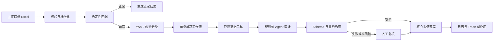

# 当前系统地图

本文只描述当前代码实际执行路径，不记录未来规划、失败实验或已经被替代的历史方案。

## 一句话理解

系统先用确定性代码完成双源匹配和异常分类，再按异常分支读取受控证据，由规则或 Agent 给出审计建议；任何证据缺失、模型失败或约束冲突都转人工，最终结果由代码事务落库。

## 主执行链

## 从请求到结果的代码路径

| 顺序 | 职责 | 入口 |
| --- | --- | --- |
| 1 | HTTP/JWT/SSE 请求 | `api/v1/reconcile.py` |
| 2 | 应用流程、任务状态、查询接口 | `services/reconciliation/service.py` |
| 3 | 文件读取、任务哈希、匹配结果转换 | `services/reconciliation/input.py` |
| 4 | 双源匹配与异常分支 | `services/exception_router.py`、`services/rule_engine.py` |
| 5 | 批次并发、顺序归并、进程级并发上限 | `services/reconciliation/batch.py` |
| 6 | 单条 flow 的工作流调用、日志和台账组装 | `services/reconciliation/flow.py` |
| 7 | 单条异常编排 | `services/workflow/runner.py` |
| 8 | 状态类型与分支常量 | `services/workflow/types.py` |
| 9 | Trace、SSE、token 与安全日志投影 | `services/workflow/runtime.py` |
| 10 | ToolContext、工具调用与工具失败转人工 | `services/workflow/tools.py` |
| 11 | 审计、Schema、业务约束与决策路由 | `services/workflow/decision.py` |
| 12 | 账本、队列、任务统计事务及提交后副作用 | `services/reconciliation/persistence.py` |
| 13 | 人工复核与可选 checkpoint 子图 | `services/review.py`、`services/review_graph.py` |

## 两个兼容入口

### `ReconciliationService`

`services/reconciliation/__init__.py` 保留现有导入路径，实际应用服务位于 `services/reconciliation/service.py`。它负责按顺序调用输入、批次、flow 和持久化模块，不再承载这些模块的具体算法。

### `run_item`

`services/workflow/__init__.py` 保留现有导入路径，实际编排位于 `services/workflow/runner.py`。状态定义、Trace/SSE、工具边界和审计决策分别位于同一子包的独立模块。

## 事务与失败边界

- 账本、人工队列和任务统计在同一数据库事务中提交。
- RAG 日志、Agent 日志和 Trace 在核心事务提交后执行，失败不会回滚业务结果。
- 模型或工具的最终失败只关闭当前异常项并转人工，不触发整批 ARQ 重放。
- Redis 或数据库瞬时错误可以触发任务级重试。
- SSE 是单进程内存事件流；Replay 读取已经持久化的 Trace，不会重新执行工作流。

## 当前没有的能力

- 没有独立、版本化的 Confirmed Case Store；`load_confirmed_cases` 当前读取近期已复核差错台账。
- LangGraph 不负责主对账流程，只用于可选人工复核 checkpoint 子图。
- Tool 由代码选择，不是 LLM 自主 function calling。
- 当前交付是个人本地原型，不代表生产部署、真实银行数据或线上 SLA。

## 建议阅读顺序

第一次阅读只看下面六个文件：

1. `api/v1/reconcile.py`
2. `services/reconciliation/service.py`
3. `services/reconciliation/input.py`
4. `services/exception_router.py`
5. `services/workflow/runner.py`
6. `services/workflow/decision.py`

理解主链后，再按需要阅读批次并发、工具、Trace、持久化和评测模块。`docs/stages/` 与大部分 ADR 用于解释历史演进，不应作为理解当前运行路径的入口。
